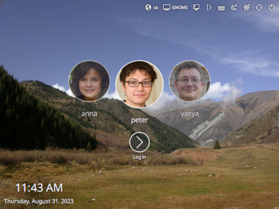

<!---
SPDX-FileCopyrightText: None
SPDX-License-Identifier: CC0-1.0
-->

# LightDM KDE Greeter

This project is one of many greeters for
[LightDM](https://github.com/canonical/lightdm).



## Configuration

LightDM configuration is provided by the following files:

```
/usr/share/lightdm/lightdm.conf.d/*.conf
/etc/lightdm/lightdm.conf.d/*.conf
/etc/lightdm/lightdm.conf

```

LightDM KDE Greeter uses `lightdm-kde-greeter.conf` for its configuration.

System provided configuration should be stored in
`/usr/share/lightdm/lightdm.conf.d/`. System administrators can override this
configuration by adding files to `/etc/lightdm/lightdm.conf.d/` and
`/etc/lightdm/lightdm.conf`. Files are read in the above order and combined
together to make the LightDM configuration.


Thus, to enable lightdm-kde-greeter as the current lightdm greeter, you can
make a file `/etc/lightdm/lightdm.conf.d/50-myconfig.conf` with the following:

```
[Seat:*]
greeter-session=lightdm-kde-greeter
```

For most installations you will want to change the keys in the `[Seat:*]`
section as this applies to all seats on the system (normally just one). A
configuration file showing all the possible keys is provided in
[`data/lightdm.conf`](https://github.com/Canonical/lightdm/blob/master/data/lightdm.conf).

This repository also contains the KDE configuration module, to configure
greeter parameters via GUI. Once installed it should be accessible via *[System
Settings](https://userbase.kde.org/System_Settings) -> Startup and Shutdown ->
Login Screen (LightDM)*.

## Links
 - [Bug Reports](https://bugs.kde.org/buglist.cgi?component=general&list_id=2676795&product=lightdm&resolution=---)
